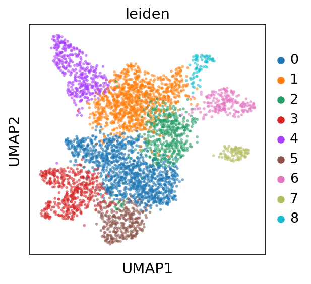
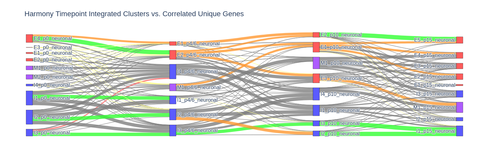
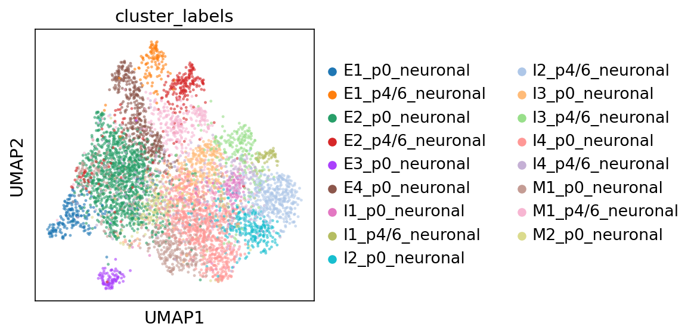

# Superior Colliculus Neuronal Subtype Analysis

## Overview
This repository implements a comprehensive gene expression analysis pipeline for neuronal subtypes in the **Superior Colliculus**. The project applies advanced bioinformatics techniques to categorize neuronal clusters, analyze differentially expressed genes, and identify correlations across timepoints.

## Features
- **Neuronal Subtype Identification:** Dotplots for excitatory, inhibitory, and mixed neuronal classification.
- **Gene Expression Analysis:** Identification of **differentially expressed genes (DEGs)** across multiple timepoints.
- **Cluster Relationship Mapping:** UMAP projections, dendrogram analysis, and harmony-based cluster integrations.
- **Sankey Plot Analysis:** Visualization of neuronal cluster evolution over time.
- **Superior Colliculus Layer Correlation:** Statistical analysis to determine gene expression specificity to anatomical layers.
- **Neurodevelopmental Disorder Associations:** Expression analysis of genes linked to **Schizophrenia** and **Autism**.

---

## Project Workflow

### **1. Data Processing & Preprocessing**
- Raw gene expression data is preprocessed: **filtering, normalization, log-transform, and batch effect correction**.
- High-variance genes are selected to enhance clustering accuracy.

### **2. Quick Run vs. Full Run**
- **Quick Run:** Uses pre-saved results for faster execution.
- **Full Run:** Executes all functions from scratch (may take over an hour).

### **3. Cluster & Gene Analysis**
- **Timepoint UMAPs:** Visualizes cellular clustering at different stages.
- **Differential Expression:** Identifies highly expressed genes in each cluster.
- **Gene Filtering:** Assigns neuronal subtypes and ranks genes by expression.

### **4. Advanced Analyses**
- **Cluster Distinction:** Categorizes clusters into *True Distinct, Relative Distinct, and Non-Distinct*.
- **Correlated Unique Genes:** Tracks unique gene overlap across timepoints.
- **Harmony Integration:** Aligns clusters across time for **temporal correlation analysis**.
- **Sankey Plots:** Maps lineage progression of clusters.

### **5. Statistical & Hypothesis Testing**
- **Superior Colliculus Layer Correlation:** Compares gene expression in specific layers.
- **Schizophrenia & Autism Gene Analysis:** Identifies cluster-specific gene expression patterns.

---

## **Visualization Examples**
### **Timepoint UMAP**


### **Dot Plot for Differentially Express Neuronal Genes**


### **Sankey Diagram of Cluster Correlations**


### **DotPlot Triangle: Shared Genes between Clustural Neighbors**

### **Harmony Timeseries Umap**


### **P-Value Hypothesis Testing of Layer-specific Cluster Correlations**


---

## **File Structure**
```
📂 Superior_Colliculus_Project
│── 📂 Permanent_Results              # Permanent results from analysis
│── 📂 Testing_Results           # Temporary tssting for test implementation
│── 📂 All_Programs         # Custom functions for analysis
```

---

## **How to Run**
1. **Clone the repository**  
   ```bash
   git clone https://github.com/koushikparakulam/Superior_Colliculus_Project.git
   cd Superior_Colliculus_Project
   ```

2. **Install dependencies**  

```
  !pip install 'matplotlib == 3.6'
  !pip install 'scanpy == 1.9.1'
```

3. **Set Quick Run or Full Run**  
   - Modify the `Quick_Run` parameter in `MAIN_Load_Output.ipynb`:
     - `True`: Loads pre-saved results for quick testing.
     - `False`: Runs all computations from scratch.

4. **Run the main analysis script**  
   ```bash
   python MAIN_Load_Output.ipynb
   ```

---

## **Data Sources**
- **Allen Brain Atlas API:** Layer-specific gene expression.
- **Panther Ontology:** Functional gene classification.
- **Custom Pre-Processed Data:** Includes normalized gene expression matrices.

---

## **Acknowledgments**
Special thanks to the **Bioinformatics & Computational Neuroscience team @FeildheimLabs** for their insights and support in developing this project.
